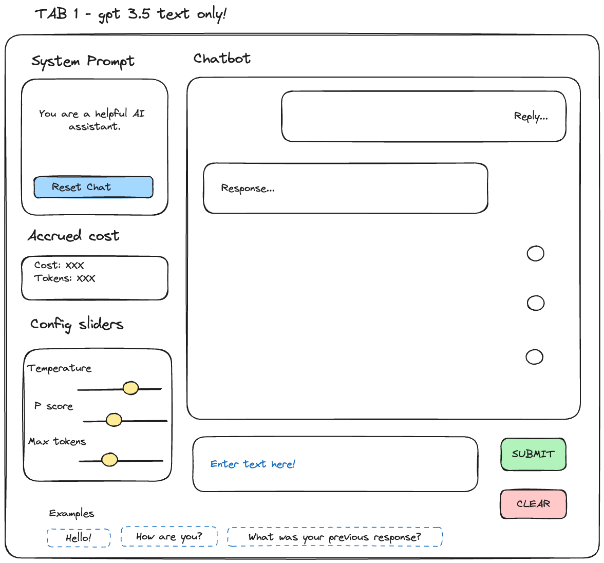

# chatbot-assistant

A gradio app for a chatbot assistant utilising the openai API. Current key features:

- Streaming output
- Gradio frontend for chatting
- Keeps session state memory

## Table of Contents

- [Table of Contents](#table-of-contents)
- [Setup](#setup)
- [How to run](#how-to-run)
- [Envisioned UI design](#envisioned-ui-design)
  - [List of designs](#list-of-designs)
  - [Designs](#designs)

## Setup

Add a .venv with the following entry

```
OPENAI_API_KEY=<OPENAI_API_KEY>
```

Create a venv, install `pip-compile-multi` in venv, and then run the convenience function below for setting up the venv

```bash
make sync_requirements
```

## How to run

Run the gradio app using the below convenience function.

```bash
make run
```

## Envisioned UI design

### List of designs

App 1

- Text with config sliders
- Text with RAG search prompt (langchain)
  - Chunking params
  - Retrieved chunks output
  - Prompt template used

App 2

- Text + image -> Text output

App 3

- Text -> Image output

App 4

- Text -> Audio output

App 5

- Audio -> Text output

### Designs

**Chatbot design 1**


